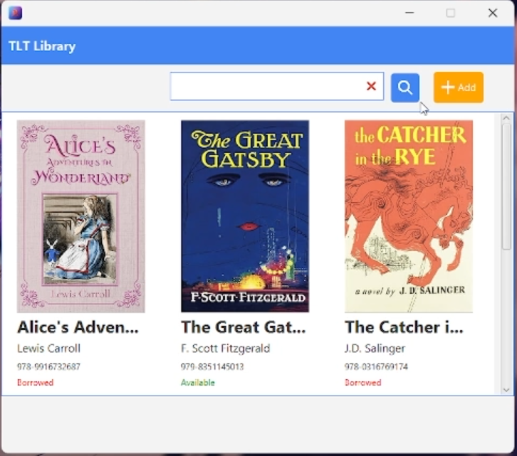

# 📚 Library Management System (JavaFX)

A GUI-based Library Management System developed using **JavaFX** for user interaction and **CSV file handling** for persistent storage. This project allows users to **add**, **search**, **borrow**, and **return** books efficiently, integrating both frontend and backend operations in a modular Java application.

## ✨ Features

- Add new books to the collection  
- Search books by title, author, or ISBN  
- Borrow and return books with borrower information tracking  
- Persistent storage using CSV files  
- Book cover thumbnails stored based on ISBN  
- Clean and user-friendly GUI built with **Scene Builder** and JavaFX

## 📸 Screenshots

## 🛠 Technologies & Tools

- Java 17  
- JavaFX  
- Scene Builder (FXML)  
- CSV File I/O  
- Modular Java Architecture (MVC-style)

## 📁 Project Structure

- `components/` – Reusable FXML UI elements  
- `controllers/` – JavaFX controllers managing UI logic  
- `data/` – Persistent data and book thumbnail storage  
- `interfaces/` – Interfaces for core class behaviors  
- `models/` – Main logic classes (`Book`, `Library`)  
- `views/` – UI layout in FXML files  
- `App.java` – Main application entry point  

## 👥 Team Members

| Name           | Matric No  | Contribution                          |
|----------------|------------|----------------------------------------|
| **Lim Wen Hao**   | 22304573   | JavaFX GUI and controller integration |
| **Teh Juin Ewe** | 22304568   | Book and Library class, search logic  |
| **Tan Jun Cheng** | 22305446   | File I/O for CSV read/write           |

## 🗃️ Data Persistence

- Book data is saved in a `.csv` file, including:
  - Title, author, ISBN
  - Availability status
  - Borrower information
- Book thumbnails stored using ISBN as filename

---

## Getting Started

Welcome to the VS Code Java world. Here is a guideline to help you get started to write Java code in Visual Studio Code.

## Folder Structure

The workspace contains two folders by default, where:

- `src`: the folder to maintain sources
- `lib`: the folder to maintain dependencies

Meanwhile, the compiled output files will be generated in the `bin` folder by default.

> If you want to customize the folder structure, open `.vscode/settings.json` and update the related settings there.

## Dependency Management

The `JAVA PROJECTS` view allows you to manage your dependencies. More details can be found [here](https://github.com/microsoft/vscode-java-dependency#manage-dependencies).
